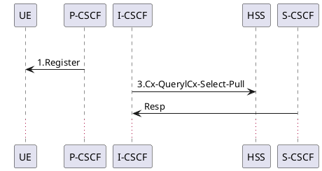
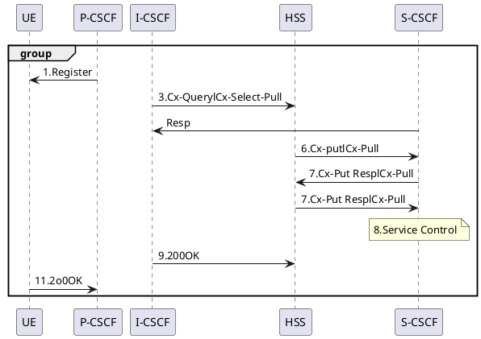

# Sequence Converter - 処理フロー説明

## 概要

Sequence Converterは、シーケンス図の画像（PNG/JPEG）を入力として受け取り、PlantUML形式のテキストファイルに変換するツールです。画像処理、OCR、コンピュータビジョン技術を組み合わせて、シーケンス図の要素を自動検出し、再現可能なコード形式で出力します。

## 処理パイプラインの全体像

``` bash

入力画像 (PNG/JPEG)
    ↓
【ステップ1】画像前処理
    ↓
【ステップ2】オブジェクトヘッダー検出
    ↓
【ステップ3】OCRテキスト抽出
    ↓
【ステップ4】メッセージ矢印検出
    ↓
【ステップ5】メッセージラベルマッピング
    ↓
【ステップ6】追加要素検出
    ↓
【ステップ7】PlantUMLコード生成
    ↓
出力ファイル (.puml)
```

---

## 実行例

### 入力画像

[input/3gpp23228_fig0501.png](input/3gpp23228_fig0501.png)

この画像は3GPP規格書からの通信シーケンス図で、以下の要素を含んでいます：

- **参加者（Participant）**: UE, P-CSCF, I-CSCF, HSS, S-CSCF
- **メッセージ矢印**: 参加者間の通信を示す矢印
- **メッセージラベル**: 各メッセージの内容（例：Register, Cx-Query, 200OK等）
- **ノート**: 追加の説明（例：Service Control）
- **グループ化**: 複数のメッセージをまとめるフラグメント

### 出力ファイル

[output/3gpp23228_fig0501.puml](output/3gpp23228_fig0501.puml)



---

## 詳細な処理ステップ

### 【ステップ1】画像前処理

**実装**: [src/sequence_converter/preprocessing.py](src/sequence_converter/preprocessing.py)

入力画像を解析しやすい形式に変換します。

#### 処理内容

1. **画像読み込み**
   - PIL（Python Imaging Library）で画像を読み込み
   - 透明チャネル（RGBA/LA/P）を持つ画像は白背景に変換

2. **RGB変換**
   - NumPyを使用してRGB形式に変換

3. **BGR変換**
   - OpenCVフォーマット（BGR）に変換

4. **グレースケール化**
   - `cv2.cvtColor()`でグレースケール画像を生成

5. **ノイズ除去**
   - メディアンブラー（デフォルト）またはガウシアンブラー
   - カーネルサイズ: 5x5（設定可能）

6. **二値化（反転）**
   - 大津の手法（Otsu's method）またはアダプティブ閾値処理
   - `cv2.THRESH_BINARY_INV`を使用して黒線を白、白背景を黒に変換
   - **重要**: 二値反転により、後続の処理で線が白いピクセルとして扱われる

#### 出力

`PreprocessedImage`データクラス:

- `grayscale`: グレースケール画像（uint8）
- `binary`: 二値化反転画像（uint8）
- `original_shape`: 元の画像サイズ（高さ, 幅）

#### 3gpp23228_fig0501.pngの例

この画像の前処理では：

- 元サイズ: 約1400x1000ピクセル
- 白背景に黒い線のシーケンス図が二値化により白線に変換される
- OCRとコンピュータビジョンアルゴリズムが効率的に動作する形式に

---

### 【ステップ2】オブジェクトヘッダー検出

**実装**: [src/sequence_converter/detectors/object_header.py](src/sequence_converter/detectors/object_header.py)

シーケンス図の上部にある参加者（Participant）の四角形を検出します。

#### 検出戦略（2パスアプローチ）

##### パス1: 輪郭ベース検出

1. **検出範囲**: 画像の上部30%に焦点を当てる
2. **モルフォロジー処理**: 3x3カーネルでクロージング（細い線を接続）
3. **輪郭検出**: 外部輪郭を検出（`cv2.findContours`）
4. **サイズフィルタリング**:
   - 幅: 画像幅の20-30%
   - 高さ: 上部領域の10-15%
5. **アスペクト比フィルタリング**: 0.3～15の範囲

##### パス2: OCRベースのテキスト領域検出

1. **テキスト領域抽出**: OCRバックエンドを使用して上部30%のテキスト領域を抽出
2. **フィルタリング**: サイズと位置の制約を適用

##### 統合と最適化

1. **候補のマージ**: 輪郭ベースとOCRベースの候補を統合
2. **重複除去**: IoU（Intersection over Union）> 0.5で重複を除去
3. **OCRテキスト抽出**: 各候補領域からテキストを抽出
   - メッセージラベル（パターン: `^\d+\.`）をスキップ
   - テキスト長に基づいて信頼度を計算

#### 出力

`ObjectHeader`のリスト（左から右へソート）:

- `name`: 参加者名
- `lifeline_x`: ライフライン（縦線）のX座標（バウンディングボックスの中心）
- `bbox`: バウンディングボックス（left, top, width, height）
- `confidence`: 信頼度スコア

#### 3gpp23228_fig0501.pngの例

検出された参加者（左から右へ）:

1. **UE** (X座標: 約200px)
2. **P-CSCF** (X座標: 約450px)
3. **I-CSCF** (X座標: 約700px)
4. **HSS** (X座標: 約950px)
5. **S-CSCF** (X座標: 約1200px)

これらのX座標がライフラインとして、後続のメッセージ矢印のマッピングに使用されます。

---

### 【ステップ3】OCRテキスト抽出

**実装**: [src/sequence_converter/ocr.py](src/sequence_converter/ocr.py)

画像内のすべてのテキストを検出し、抽出します。

#### サポートされているOCRバックエンド

1. **Tesseract** (pytesseract経由)
2. **EasyOCR** (デフォルト) - 日本語と英語をサポート

#### 機能

- **単語レベルの検出**: 各単語のバウンディングボックスと信頼度スコアを取得
- **色検出**:
  - 赤（RED）: R>150, G<100, B<100
  - 青（BLUE）: B>150, G<100, R<100
  - その他: None
- **最小信頼度閾値**: 30%
- **信頼度スケーリング**: 0-100%の範囲にスケール

#### 出力

`OCRResult`のリスト:

- `text`: 抽出されたテキスト
- `bounding_box`: バウンディングボックス（left, top, width, height）
- `confidence`: 信頼度スコア（0-100）
- `color`: テキスト色（red/blue/None）

#### 3gpp23228_fig0501.pngの例

抽出されるテキスト:

- 参加者名: "UE", "P-CSCF", "I-CSCF", "HSS", "S-CSCF"
- メッセージラベル: "1.Register", "3.Cx-QuerylCx-Select-Pull", "Resp", "6.Cx-putlCx-Pull", "200OK"等
- ノートテキスト: "8.Service Control"

---

### 【ステップ4】メッセージ矢印検出

**実装**: [src/sequence_converter/detectors/message_arrow.py](src/sequence_converter/detectors/message_arrow.py)

ライフライン間の水平メッセージ矢印を検出します。

#### 検出プロセス

##### 1. 二値画像の準備

- 二値反転画像をコピー（黒背景に白線）

##### 2. テキスト除去

- 垂直方向の侵食（1x5カーネル）でテキスト文字を除去
- 水平線は保持される

##### 3. 線の接続

- 水平モルフォロジークロージング（100x1カーネル）
- 断片化された矢印線のギャップを埋める

##### 4. ハフ線検出

- `cv2.HoughLinesP`を使用:
  - rho=1, theta=π/180
  - threshold=20, minLineLength=80, maxLineGap=50

##### 5. 水平フィルタリング

- **角度許容度**: 水平から±5度以内
- **垂直偏差**: 水平長の8%以下
- **最小水平スパン**: 80ピクセル

##### 6. 矢印方向の検出

- 端点で矢印ヘッドを解析
- 探索領域（±10px X, ±5px Y）の非ゼロピクセルをカウント
- 右端点のピクセル数が多い → `LEFT_TO_RIGHT`
- 左端点のピクセル数が多い → `RIGHT_TO_LEFT`

##### 7. ライフラインマッチング

- 開始/終了のX座標を100px許容範囲内でライフラインにマッチング
- セルフループ（source == dest）をスキップ

##### 8. 重複除去

- Y座標（±10px許容範囲）でグループ化
- グループごとに最長の矢印を保持

#### 出力

`MessageArrow`のリスト（上から下へソート）:

- `x_start`, `x_end`: 矢印の開始・終了X座標
- `y`: 矢印のY座標
- `direction`: 方向（LEFT_TO_RIGHT/RIGHT_TO_LEFT）
- `source_lifeline`: 送信元ライフラインのX座標
- `dest_lifeline`: 送信先ライフラインのX座標

#### 3gpp23228_fig0501.pngの例

検出されるメッセージ矢印:

- Y座標約400px: UE ← P-CSCF（方向: RIGHT_TO_LEFT）
- Y座標約500px: I-CSCF → HSS（方向: LEFT_TO_RIGHT）
- Y座標約600px: S-CSCF → HSS（方向: LEFT_TO_RIGHT）
- 等々...

---

### 【ステップ5】メッセージラベルマッピング

**実装**: [src/sequence_converter/detectors/label_mapper.py](src/sequence_converter/detectors/label_mapper.py)

ステップ3で抽出したOCRテキストをステップ4で検出したメッセージ矢印に関連付けます。

#### マッピング戦略

1. **垂直探索範囲**:
   - 各メッセージ矢印のY座標から±5～30ピクセルを探索

2. **水平位置考慮**:
   - X座標が矢印と整合している必要がある

3. **スコアリング**:
   - Y距離を優先
   - X距離は副次的（重み0.5）

4. **出力**:
   - メッセージY座標 → `OCRResult`のマッピング

#### 3gpp23228_fig0501.pngの例

マッピング例:

- Y座標400pxの矢印 → "1.Register"
- Y座標500pxの矢印 → "3.Cx-QuerylCx-Select-Pull"
- Y座標600pxの矢印 → "6.Cx-putlCx-Pull"

---

### 【ステップ6】追加要素検出

複数の検出器が並行して動作し、シーケンス図の追加要素を検出します。

#### 6.1 セルフコール検出

**実装**: [src/sequence_converter/detectors/self_call.py](src/sequence_converter/detectors/self_call.py)

- **手法**: `cv2.HoughCircles`で円を検出
- **パラメータ**: minRadius=10, maxRadius=40, minDist=30
- **ライフラインマッチング**: ±30px許容範囲
- **ラベル探索**: 円の右側（±100px X, ±30px Y）
- **出力**: `SelfCall`（lifeline_x, y, label, confidence=90%）

#### 6.2 ノート注釈検出

**実装**: [src/sequence_converter/detectors/note_annotation.py](src/sequence_converter/detectors/note_annotation.py)

- **手法**: 外部輪郭検出で四角形を検出
- **面積フィルタ**: 500～50000ピクセル²
- **アスペクト比**: 0.3～10
- **テキスト抽出**: OCRでテキストを抽出
- **関連付け**: 最も近いライフラインと関連付け（±100px許容範囲）
- **出力**: `NoteAnnotation`（bbox, text, related_lifeline, confidence=85%）

##### 3gpp23228_fig0501.pngの例

- ノート: "8.Service Control" (S-CSCFのライフライン上)

#### 6.3 アクティベーションバー検出

**実装**: [src/sequence_converter/detectors/activation_bar.py](src/sequence_converter/detectors/activation_bar.py)

- **手法**: 垂直長方形を検出（反転二値画像）
- **フィルタ**: 最小高さ30px, 最大幅30px, アスペクト比≥2.0
- **ライフラインマッチング**: ±50px許容範囲
- **出力**: `ActivationBar`（lifeline_x, y_start, y_end）

#### 6.4 フラグメント検出

**実装**: [src/sequence_converter/detectors/fragment.py](src/sequence_converter/detectors/fragment.py)

- **手法**: 外部輪郭検出で大きな四角形を検出（反転二値画像）
- **面積フィルタ**: ≥10000ピクセル²
- **サイズ**: 最小幅80px, 最小高さ60px
- **ラベル抽出**: 左上領域（40x150px）からラベルを抽出
- **フラグメントタイプ識別**: ALT, LOOP, OPT, PAR, GROUP
- **出力**: `Fragment`（type, title, bbox, confidence=80%）

##### 3gpp23228_fig0501.pngの例

- グループフラグメント: 複数のメッセージを囲む大きな四角形

---

### 【ステップ7】PlantUMLコード生成

**実装**: [src/sequence_converter/generator.py](src/sequence_converter/generator.py)

検出されたすべての要素を統合し、PlantUML形式のコードを生成します。

#### 生成プロセス

##### 1. オブジェクト宣言

```plantuml
participant "UE"
participant "P-CSCF"
participant "I-CSCF"
participant "HSS"
participant "S-CSCF"
```

各参加者を左から右へソートして宣言

##### 2. イベント順序付け

- すべてのイベント（messages, self_calls, notes, fragments）を収集
- Y座標でソート（上から下へ）
- フラグメント終了イベントはY + heightの位置に配置

##### 3. メッセージ生成

- Y座標によるラベルマッピングからラベルを取得
- 色マークアップを適用: `[#red]`または`[#blue]`
- アクティベーション接尾辞を検出（++または--）
- **構文**: `"source" -> "dest" : label [color][activation]`

**例**:

```plantuml
"UE" <- "P-CSCF" : 1.Register
"I-CSCF" -> "HSS" : 3.Cx-QuerylCx-Select-Pull
```

##### 4. セルフコール生成

```plantuml
"obj" -> "obj" : label
```

##### 5. ノート生成

```plantuml
note over "S-CSCF" : 8.Service Control
```

または

```plantuml
note left : text
```

##### 6. フラグメント処理

```plantuml
group
  ... (messages inside fragment)
end
```

または

```plantuml
alt Title
  ... (messages)
end
```

##### 7. 出力フォーマット

- `@startuml`と`@enduml`で囲む
- UTF-8エンコーディングで`.puml`ファイルに保存

#### 3gpp23228_fig0501.pngの完全な出力例



---

## ツールの使い方

### コマンドライン実行

```bash
sequence-converter --input input/ --output output/
```

または

```bash
python -m sequence_converter --input input/ --output output/
```

### パラメータ

- `--input`: 入力画像が格納されたディレクトリ（PNG/JPEG形式）
- `--output`: 生成されたPlantUMLファイルの出力先ディレクトリ

### 処理の流れ

1. `input/`ディレクトリ内のすべての画像ファイルをスキャン
2. 各画像に対して7ステップのパイプラインを実行
3. `output/`ディレクトリに`.puml`ファイルを生成
   - 入力ファイル名: `3gpp23228_fig0501.png`
   - 出力ファイル名: `3gpp23228_fig0501.puml`

---

## データフローアーキテクチャ

### モデル定義

**実装**: [src/sequence_converter/models.py](src/sequence_converter/models.py)

#### 設定

- `ConversionConfig`: 入出力パス、前処理パラメータ、ライフライン許容範囲
- `PreprocessingConfig`: ブラーカーネル、閾値処理手法、ノイズ除去

#### 検出結果

- `PreprocessedImage`: 処理済み画像データ
- `ObjectHeader`: 参加者情報
- `MessageArrow`: 方向とライフラインマッピングを持つ矢印
- `OCRResult`: 色情報付きテキスト領域
- `SelfCall`, `NoteAnnotation`, `ActivationBar`, `Fragment`

#### 集約

- `SequenceDiagramElements`: 検出されたすべての要素を収集

---

## 重要な技術的詳細

### 二値画像処理

- すべての線検出は二値反転画像（黒背景に白線）を使用
- モルフォロジー演算で線を保持しながらテキストを戦略的に除去

### ライフライン座標系

- ライフラインは固定されたX座標の垂直線（オブジェクトヘッダーの中心）
- すべての要素検出は、許容範囲内で最も近いライフラインにX座標をマッチング

### 信頼度スコアリング

- オブジェクトヘッダー: テキスト長から計算
- その他の要素: 固定値（90%, 85%, 80%）
- OCR: バックエンドの信頼度に基づく0-100%

### エラーハンドリング

- ファイル存在の検証
- フォーマット検証（PNG/JPG/JPEG）
- 検出失敗の適切な処理
- 欠落要素はログに記録されるが、パイプラインをブロックしない
- マッチングしないライフラインは要素をスキップ

---

## パイプラインオーケストレーター

**実装**: [src/sequence_converter/pipeline.py](src/sequence_converter/pipeline.py)

`PipelineOrchestrator`クラスが全7ステップを順次実行し、各ステップの結果を次のステップに渡します。

### 依存性注入

各検出器モジュールは独立しており、`create_pipeline_orchestrator()`関数で初期化時に注入されます。

### エントリーポイント

**実装**: [src/sequence_converter/cli.py](src/sequence_converter/cli.py)

CLIコマンド`convert`が：

1. パイプラインオーケストレーターを作成
2. 入力ディレクトリ内の画像ファイルを反復処理
3. 各画像に対してパイプラインを実行
4. 結果を出力ディレクトリに保存

---

## まとめ

Sequence Converterは、シーケンス図の画像からPlantUMLコードへの変換を自動化する包括的なツールです。コンピュータビジョン（輪郭検出、ハフ変換）とOCR技術を組み合わせることで、複雑なシーケンス図の要素を高精度に検出し、編集可能なテキストフォーマットに変換します。

### 主な特徴

- **7ステップのパイプライン**: 前処理から最終コード生成までの体系的な処理
- **モジュラー設計**: 各検出器が独立して動作
- **ロバストな検出**: 複数のアプローチ（輪郭ベース、OCRベース）を組み合わせ
- **柔軟な設定**: 前処理パラメータ、許容範囲の調整が可能

### 今後の改善可能性

- 複雑な矢印形状（曲線矢印）のサポート
- より高度なフラグメント検出（ネストされたフラグメント）
- 機械学習ベースの要素検出の統合
- 信頼度スコアの精度向上
