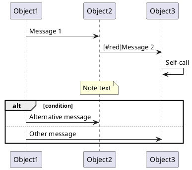

# Sequence Converter

PNG/JPG形式のシーケンス図画像をPlantUMLテキスト形式に変換するPythonツールです。コンピュータビジョンとOCR技術を使用して、シーケンス図の各コンポーネント（オブジェクト、メッセージ、ノート、フラグメントなど）を自動検出し、対応するPlantUMLコードを生成します。

## 特徴

- **包括的な検出機能**
  - オブジェクトヘッダー（参加者）の検出とOCR
  - メッセージ矢印の検出と方向判定
  - 自己呼び出し（Self-Call）の検出
  - ノート注釈の検出
  - アクティベーションバーの検出
  - フラグメント（alt、loop等）の検出

- **多言語対応**
  - 日本語と英語のテキスト認識に対応
  - TesseractとEasyOCRの2つのOCRエンジンをサポート

- **色情報の保持**
  - テキストの色（赤、青など）を検出し、PlantUMLの色構文として出力

- **堅牢なエラー処理**
  - 一部の検出が失敗しても処理を継続
  - 詳細なログ出力で問題の追跡が容易

## 必要な環境

- Python 3.10以上
- Tesseract OCR（システムにインストール済みであること）

### Tesseractのインストール

**macOS:**

```bash
brew install tesseract
brew install tesseract-lang  # 日本語サポート用
```

**Ubuntu/Debian:**

```bash
sudo apt-get update
sudo apt-get install tesseract-ocr
sudo apt-get install tesseract-ocr-jpn  # 日本語サポート用
```

**Windows:**

[Tesseractの公式インストーラー](https://github.com/UB-Mannheim/tesseract/wiki)をダウンロードしてインストールしてください。

## セットアップ

### 1. リポジトリのクローン

```bash
git clone <repository-url>
cd sequence_converter
```

### 2. 依存関係のインストール

**uvを使用する場合（推奨）:**

```bash
# 開発環境としてインストール
uv pip install -e ".[dev]"
```

**pipを使用する場合:**

```bash
# 開発環境としてインストール
pip install -e ".[dev]"

# または本番環境として
pip install -e .
```

### 3. インストールの確認

```bash
sequence-converter --help
```

正常にインストールされていれば、コマンドのヘルプが表示されます。

## 使用方法

### 基本的な使い方

1. **入力画像の準備**

   `input/`ディレクトリにPNG/JPG形式のシーケンス図画像を配置します：

   ```bash
   mkdir -p input
   cp your-sequence-diagram.png input/
   ```

2. **変換の実行**

   ```bash
   sequence-converter convert
   ```

   これにより、`input/`ディレクトリ内のすべての画像が処理され、結果が`output/`ディレクトリに`.puml`ファイルとして保存されます。

### カスタムディレクトリの指定

入力・出力ディレクトリをカスタマイズできます：

```bash
# 短縮オプション
sequence-converter convert -i ./images -o ./plantuml

# 長いオプション名
sequence-converter convert --input ./images --output ./plantuml
```

### 出力例

入力画像に対して、以下のようなPlantUMLコードが生成されます：



生成されたコードは標準出力にも表示され、同時にファイルとして保存されます。

## プロジェクト構造

```text
sequence_converter/
├── src/
│   └── sequence_converter/
│       ├── cli.py                    # CLIインターフェース
│       ├── pipeline.py               # 変換パイプライン全体の統括
│       ├── preprocessing.py          # 画像前処理
│       ├── ocr.py                    # OCRエンジン（Tesseract/EasyOCR）
│       ├── generator.py              # PlantUMLコード生成
│       ├── models.py                 # データモデル定義
│       ├── logger.py                 # ロギング設定
│       └── detectors/
│           ├── object_header.py      # オブジェクトヘッダー検出
│           ├── message_arrow.py      # メッセージ矢印検出
│           ├── label_mapper.py       # メッセージラベルのマッピング
│           ├── self_call.py          # 自己呼び出し検出
│           ├── note_annotation.py    # ノート注釈検出
│           ├── activation_bar.py     # アクティベーションバー検出
│           └── fragment.py           # フラグメント検出
├── tests/                            # テストコード
├── input/                            # 入力画像ディレクトリ
├── output/                           # 出力.pumlファイルディレクトリ
├── pyproject.toml                    # プロジェクト設定
└── README.md
```

## 開発

### テストの実行

```bash
# すべてのテストを実行
pytest

# 詳細な出力を表示
pytest -v

# 特定のテストファイルのみ実行
pytest tests/test_pipeline.py
```

### コードフォーマット

```bash
# Blackでフォーマット
black .

# isortでインポート文を整理
isort .

# Flake8でリント
flake8 .
```

### pre-commitフックの設定

```bash
# pre-commitのインストール
pre-commit install

# すべてのファイルに対して実行
pre-commit run --all-files
```

## トラブルシューティング

### Tesseractが見つからない

**エラー:** `TesseractNotFoundError`

**解決策:** Tesseractがシステムパスに含まれていることを確認してください。

```bash
# Tesseractのバージョンを確認
tesseract --version
```

Windowsの場合、環境変数PATHにTesseractのインストールパスを追加する必要がある場合があります。

### 日本語テキストが認識されない

**解決策:** 日本語の言語データがインストールされているか確認してください：

```bash
# macOS/Linux
tesseract --list-langs

# 出力に 'jpn' が含まれていることを確認
```

含まれていない場合は、日本語の言語データをインストールしてください。

### EasyOCRのモデルダウンロードエラー

初回実行時、EasyOCRは必要なモデルをダウンロードします。ネットワーク環境によってはタイムアウトする場合があります。

**解決策:** インターネット接続を確認し、再試行してください。モデルは`~/.EasyOCR/`にキャッシュされます。

### OCRの精度を確認したい

**デバッグツール:** OCRがどのようにテキストを検出しているか視覚的に確認できます。

```bash
# 基本的な使い方（Tesseract）
uv run python debug_ocr.py input/3gpp23228_fig0501.png

# EasyOCRで確認
uv run python debug_ocr.py input/3gpp23228_fig0501.png --engine easyocr

# TesseractとEasyOCRを並べて比較
uv run python compare_ocr_engines.py input/3gpp23228_fig0501.png
```

これにより、以下が確認できます：

- 検出されたテキスト領域のバウンディングボックス
- 各テキストの信頼度スコア（緑: ≥80%, 黄: 60-79%, 赤: <60%）
- 検出されたテキスト内容と座標の一覧
- TesseractとEasyOCRの検出結果の違い

### オブジェクトヘッダー（参加者）の検出を確認したい

**デバッグツール:** オブジェクトヘッダー検出プロセスを段階的に可視化できます。

```bash
# 基本的な使い方（Tesseract）
uv run python debug_object_headers.py input/3gpp23228_fig0501.png

# EasyOCRで確認
uv run python debug_object_headers.py input/3gpp23228_fig0501.png --engine easyocr
```

これにより、以下が確認できます：

- 画像前処理の各ステップ（オリジナル → グレースケール → 二値化）
- 検出された全ての輪郭（contours）
- フィルタリング条件（サイズ、アスペクト比、テキストの有無）で除外された輪郭
- 最終的に検出されたオブジェクトヘッダーとライフライン位置
- 各オブジェクトの名前とバウンディングボックス座標

## 制約事項

- 入力画像は明瞭で、十分な解像度が必要です
- 手書きのシーケンス図よりも、ツールで生成された図の方が認識精度が高くなります
- 複雑に重なり合った要素や、極端に小さいテキストは認識が困難な場合があります
- メッセージ矢印のマッチング許容範囲は20ピクセル以内です
- メッセージラベルの探索範囲は矢印から上下5〜30ピクセルです

## ライセンス

（ライセンス情報を追加してください）

## 貢献

バグ報告や機能リクエストは、GitHubのIssueでお願いします。プルリクエストも歓迎します。

## 関連リソース

- [PlantUML公式サイト](https://plantuml.com/)
- [PlantUMLシーケンス図ガイド](https://plantuml.com/sequence-diagram)
- [Tesseract OCR](https://github.com/tesseract-ocr/tesseract)
- [EasyOCR](https://github.com/JaidedAI/EasyOCR)
